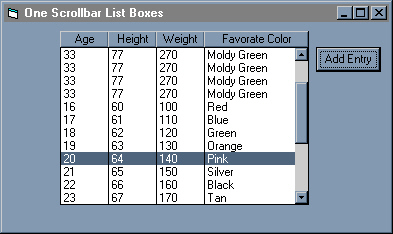



## One Scrollbar for bound lists

### Description

Allows you to bind listboxes together with only one scrollbar per grouping of lists
 
### More Info
 
Code is uncomented but should be easy to follow..if not e-mail me...dan@factek.com

             |
---                |---
**Submitted On**   |2000-08-16 11:22:58
**By**             |[Dan Dmytrasz](https://github.com/Planet-Source-Code/PSCIndex/blob/master/ByAuthor/dan-dmytrasz.md)
**Level**          |Advanced
**User Rating**    |4.4 (22 globes from 5 users)
**Compatibility**  |VB 3\.0, VB 4\.0 \(16\-bit\), VB 4\.0 \(32\-bit\), VB 5\.0, VB 6\.0
**Category**       |[Miscellaneous](https://github.com/Planet-Source-Code/PSCIndex/blob/master/ByCategory/miscellaneous__1-1.md)
**World**          |[Visual Basic](https://github.com/Planet-Source-Code/PSCIndex/blob/master/ByWorld/visual-basic.md)
**Archive File**   |[CODE\_UPLOAD90098162000\.zip](https://github.com/Planet-Source-Code/dan-dmytrasz-one-scrollbar-for-bound-lists__1-10728/archive/master.zip)

